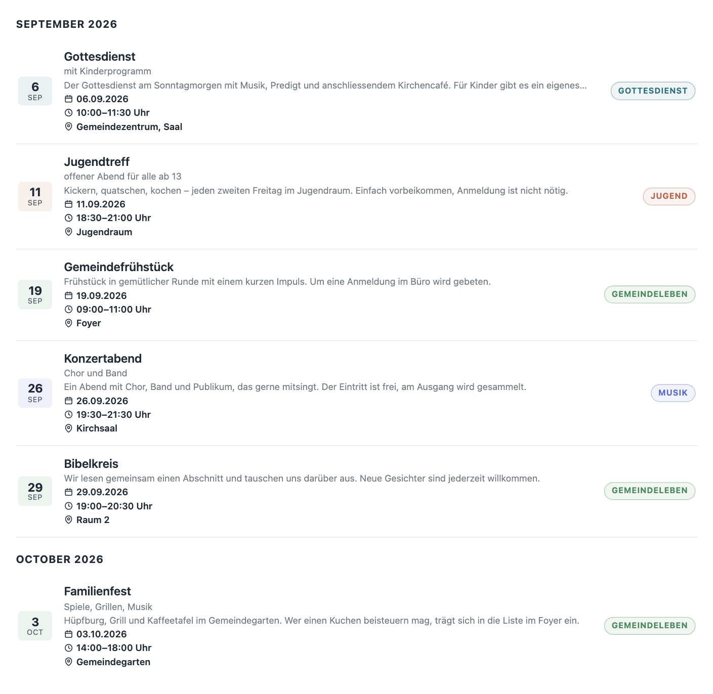
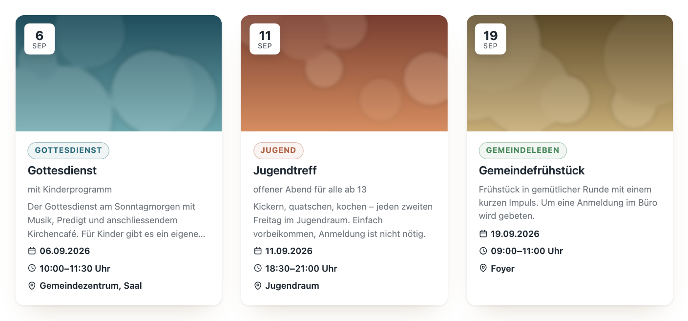
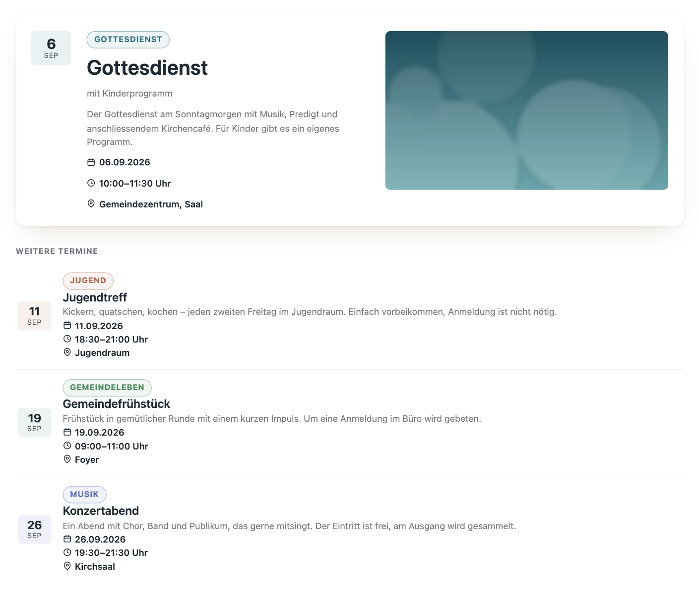
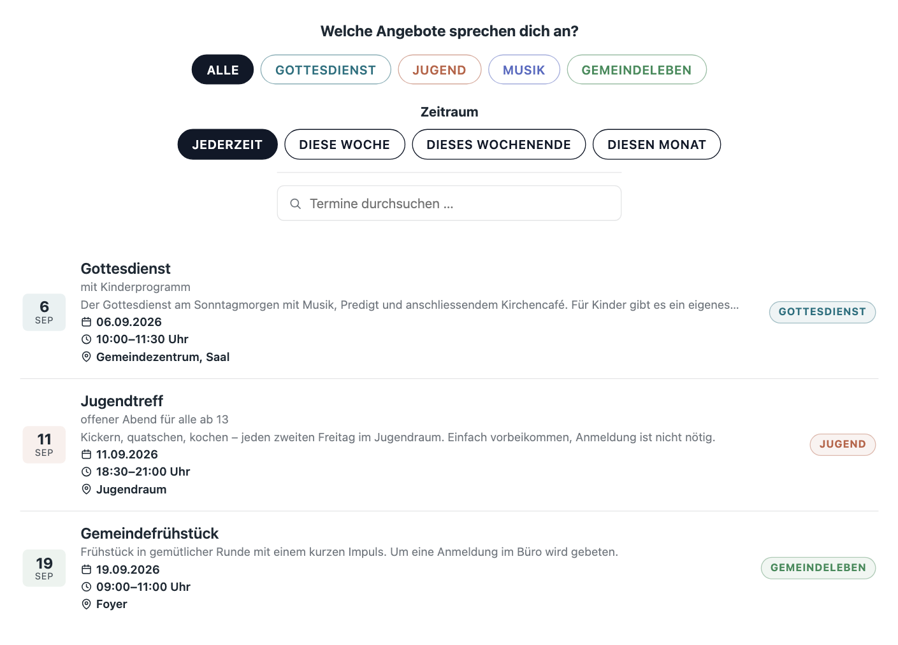
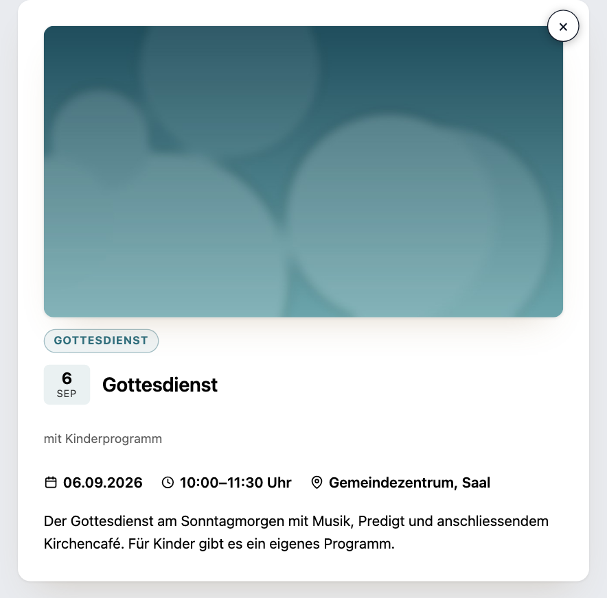

# ChurchTools Events

Holt die Termine ausgewählter ChurchTools-Kalender automatisch nach WordPress und zeigt sie dort in drei fertig gestalteten Ansichten an — als Liste, als Kachelraster oder als „Nächster Termin". Termine werden einmal in ChurchTools gepflegt und erscheinen auf der Website von selbst.

- **Automatischer Abgleich** per WP-Cron; Intervall und Vorlaufzeitraum einstellbar. Terminserien („jeden Montag") kommen als einzelne Termine an, abgesagte verschwinden wieder.
- **Drei Ansichten**, einbindbar als Shortcode, Gutenberg-Block oder WPBakery-Element.
- **Finden statt scrollen**: Kalenderfilter, Suche, Monatstrenner und der geführte „Du suchst …"-Eventfinder.
- **Termindetails** wahlweise als Popup oder als eigene Termin-Seite.
- **Aussehen einstellbar** im Backend, mit Live-Vorschau — ohne CSS anfassen zu müssen.
- **Bilder werden importiert** statt von ChurchTools nachgeladen: Besucher laden nichts von der ChurchTools-Domain.
- **Updates** kommen wie bei jedem anderen Plugin über die WordPress-Plugin-Übersicht.

Voraussetzungen: WordPress ab 6.4, PHP ab 8.1, eine ChurchTools-Instanz und ein API-Key dafür.

## So sieht das aus

Alle Bilder zeigen erfundene Beispieltermine mit Platzhalterbildern.

**Liste** — kompakte Zeilen mit Datums-Chip, Kategorie, Titel, Zeit und Ort; mit `month_dividers="1"` nach Monaten gruppiert.



**Kachelraster** — Bild, Datums-Badge und ein kurzer Auszug, Spaltenzahl einstellbar. Termine ohne eigenes Bild bekommen eine Fläche in der Farbe ihres Kalenders.



**Nächster Termin** — eine große Kachel für den nächsten Termin, darunter die folgenden in Kurzform.



**Eventfinder** — geführter Einstieg statt Dropdown: ein Knopf je Thema in der Farbe des Kalenders, dazu Zeitraum und Suche. Geht ein Zeitraum leer aus („Diesen Monat" am Monatsende), stehen die nächsten Termine danach darunter statt einer leeren Liste.



**Termindetails** — als Popup auf derselben Seite (im Bild) oder als eigene Termin-URL.



## Installation

1. Unter [Releases](https://github.com/wirsindcgks/churchtools-plugin/releases) beim neuesten Eintrag die Datei `churchtools-plugin-vX.Y.Z.zip` herunterladen. **Nicht** „Source code (zip)" — darin fehlen die fertig gebauten Bestandteile, das Plugin läuft damit nicht.
2. In WordPress unter *Plugins → Installieren → Plugin hochladen* die ZIP-Datei auswählen und installieren.
3. Plugin aktivieren. Im linken Menü erscheint der Punkt **ChurchTools**.

Ab dann meldet sich das Plugin selbst, wenn es eine neue Version gibt — die Aktualisierung läuft über die normale Plugin-Übersicht.

## Einrichten in fünf Minuten

1. **Verbindung herstellen.** *ChurchTools → Verbindung*: den Instanz-Namen eintragen — bei `https://musterkirche.church.tools` also `musterkirche` — und den API-Key hinterlegen. Der Key ist ein Login-Token aus ChurchTools; welche Kalender das Plugin sieht, hängt an den Rechten des zugehörigen Zugangs. Ein Klick auf **Verbindung testen** prüft beides sofort, auch ungespeichert.
2. **Kalender auswählen.** *ChurchTools → Kalender*: **Kalender von ChurchTools laden**, dann die gewünschten anhaken. Optional je Kalender eine Farbe (taucht im Frontend als Kategorie-Auszeichnung wieder auf) und ein Standardbild für Termine ohne eigenes Bild.
3. **Erstmals abgleichen.** *ChurchTools → Übersicht*: **Jetzt synchronisieren**. Danach übernimmt WP-Cron im eingestellten Intervall.
4. **Termine einbauen.** Auf einer Seite den Block „ChurchTools Events" einfügen (oder das WPBakery-Element bzw. den Shortcode, siehe unten).
5. **Aussehen anpassen.** *ChurchTools → Design*: eine von vier Stil-Vorlagen als Grundlage (Standard, Ruhig, Warm, Strukturiert), darunter Reihenfolge und Sichtbarkeit der Angaben auf einer Kachel, Eckenstil, Bild-Seitenverhältnis, Akzentfarbe — mit Vorschau daneben. Die Einzeleinstellungen gelten über der Vorlage: Wer „Eckig“ wählt, bekommt eckige Ecken auch in einer Vorlage mit runden.

6. **Wenn Termine eine eigene Seite bekommen sollen.** Im selben Tab bei *Bei Klick auf eine Kachel* „Eigene Seite“ wählen und darunter unter *Adresse der Terminseite* eine bestehende Seite auswählen — meist die, auf der die Terminliste steht. Die Termine liegen dann unter deren Adresse (`/termine/gottesdienst-06-09-2026/`) und werden als Inhalt dieser Seite ausgeliefert, also mit der Vorlage, dem Kopf- und dem Fußbereich des Theme. Ohne ausgewählte Seite funktioniert alles weiter, die Adresse ist dann `/churchtools-termin/4021/` und die Seite steht neben statt in der Vorlage des Theme.

Läuft etwas nicht, steht der Grund auf der Übersichtsseite: Sie zeigt den letzten Abgleich, die Zahl gespeicherter Termine und Fehler im Klartext.

## Termine auf einer Seite anzeigen

Alle drei Wege benutzen denselben Unterbau und können dasselbe:

- **Gutenberg-Block** — Block „ChurchTools Events" einfügen, alles Weitere in der Seitenleiste rechts.
- **WPBakery** — Element „ChurchTools Events" aus der Kategorie „ChurchTools".
- **Shortcode** — für Theme-Dateien, Widgets und alles andere.

### Beispiele

**Startseite: der nächste Termin, groß, mit drei weiteren darunter**

```
[ctp_events layout="upcoming" limit="4"]
```

**Terminseite: alle Kalender mit geführter Suche und Monatsüberschriften**

```
[ctp_events layout="list" eventfinder="1" month_dividers="1"]
```

**Nur die Gottesdienste als Kachelraster, drei Spalten**

```
[ctp_events calendar="Gottesdienste" layout="grid" columns="3"]
```

**Teaser in der Seitenleiste: drei Termine, ohne Nachladen-Button**

```
[ctp_events layout="list" limit="3" paging="0"]
```

**Zwei Kalender, Auswahl per Dropdown und Suchfeld**

```
[ctp_events calendar="Gottesdienste,Jugend" layout="list" filter="1" search="1"]
```

Welche Kalender-Namen und -IDs zur Verfügung stehen, zeigt der Tab *Kalender*. Im Tab *Einbinden* stehen dieselben Beispiele noch einmal — dort mit einem echten Kalender aus der eigenen Instanz eingesetzt, fertig zum Kopieren, samt Tabelle aller Optionen.

### Die wichtigsten Optionen

| Option | Wirkung |
| --- | --- |
| `calendar` | Kalender-IDs und/oder -Namen, kommagetrennt. Leer = alle aktiven |
| `layout` | `list` (Standard), `grid` oder `upcoming` |
| `columns` | Spalten bei `grid`, 2–6 (Standard 3); auf schmalen Bildschirmen automatisch weniger |
| `limit` | Obergrenze; bei `upcoming` die Gesamtzahl inklusive der großen Kachel |
| `eventfinder` | Geführte „Du suchst …"-Leiste mit Themen- und Zeitraum-Knöpfen |
| `filter` / `search` | Kalender-Dropdown bzw. Suchfeld (die einfache Variante des Eventfinders) |
| `month_dividers` | Termine nach Monaten gruppieren |
| `months` / `paging` | Länge eines Zeitraums bzw. der „Weitere Termine laden"-Knopf |
| `click` | Was ein Klick auf eine Kachel tut: `popup`, `page` oder `none` |

Die vollständige Referenz mit allen Standardwerten und Feinheiten steht in [readme.txt](readme.txt) — dieselbe Datei, die WordPress in der Plugin-Detailansicht anzeigt.

## Gut zu wissen

**Es wird nicht alles auf einmal geladen.** Liste und Grid zeigen zunächst den laufenden und den nächsten Monat; „Weitere Termine laden" hängt die folgenden an, ohne die Seite neu zu laden. Das hält die Seite schnell, auch bei vielen wöchentlichen Serien. Abschaltbar mit `paging="0"`.

**Filter und Suche laufen im Browser** und funktionieren deshalb auch hinter einem Caching-Plugin. Was jenseits des geladenen Zeitraums liegt, holt das Plugin bei Bedarf nach.

**Die Adresse eines Termins besteht aus Titel und Datum** (`gottesdienst-06-09-2026`), nicht aus einer Nummer und nicht aus dem Titel allein: „Gottesdienst" gibt es jedes Wochenende, ein Titel benennt also eine Serie und nicht einen Termin. Ändert sich der Titel in ChurchTools, ändert sich die Adresse mit. Wird die Elternseite nachträglich gesetzt, leiten die bisherigen Adressen dauerhaft auf die neuen weiter.

**Alte Termine räumen sich selbst weg**, samt importierter Bilder, nach der im Tab *Synchronisation* eingestellten Frist.

**Ein eigenes Layout** ist möglich, aber selten nötig: Die Templates aus `includes/Frontend/templates/` lassen sich nach `wp-content/themes/euer-theme/churchtools-plugin/` kopieren und dort anpassen — updatesicher. Details dazu in [readme.txt](readme.txt).

**Grenzen**: eine ChurchTools-Instanz pro WordPress-Installation, Multisite ungetestet, kein Monatskalender-Raster. Der API-Key ist an die WordPress-Salts (`AUTH_KEY`) gebunden — nach einem Serverumzug mit neuen Salts muss er einmal neu eingegeben werden; das Plugin sagt das im Backend.

## Fragen und Antworten

Antworten zu Sync-Intervall und WP-Cron, deaktivierten Kalendern, Serverumzügen und Datenschutz stehen im FAQ-Teil der [readme.txt](readme.txt) — im Backend bequemer zu lesen unter *Plugins → ChurchTools Events → Details*.

Ein Problem gefunden oder etwas vermisst? [Issues](https://github.com/wirsindcgks/churchtools-plugin/issues) im Repository.

## Für Entwickler

Aufbau, Klassen, Theme-Overrides, lokale Entwicklung und der Release-Ablauf: [docs/ARCHITECTURE.md](docs/ARCHITECTURE.md). Alle nennenswerten Änderungen stehen im [Changelog](CHANGELOG.md).

## Lizenz

GPL-2.0-or-later, siehe [LICENSE](LICENSE).
