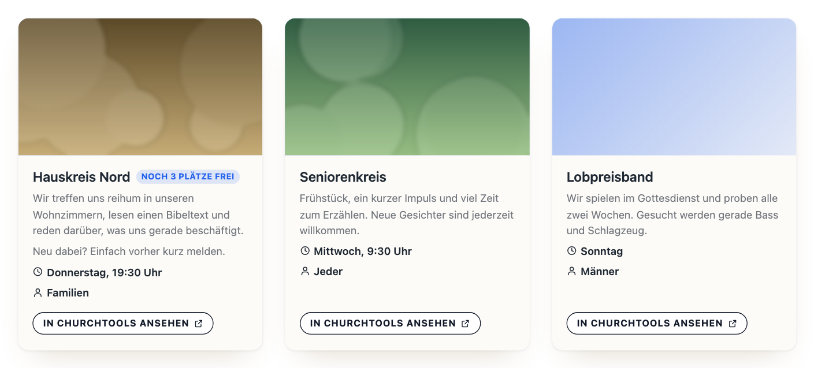
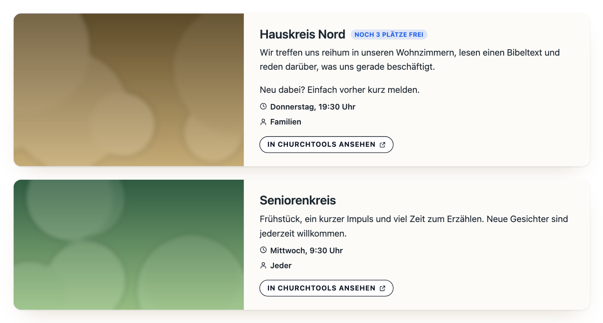
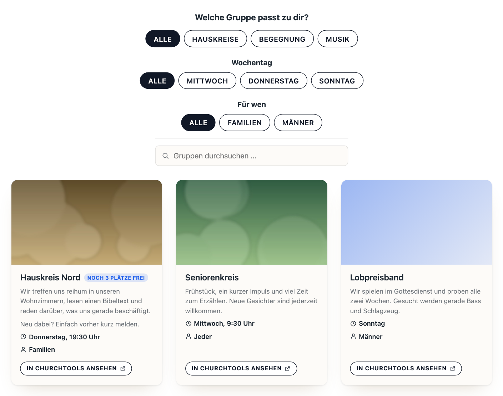

# Gruppen anzeigen

Zurück zur [Übersicht](../README.md).

Als Ersatz für den iframe einer Gruppen-Homepage: dieselben Gruppen, aber in der Optik des Plugins – mit Zielgruppe, Treffzeit, Auszug und, wo die Gruppe eine Höchstzahl hat, den freien Plätzen. Der Button „In ChurchTools ansehen“ führt zur Gruppe in ChurchTools, wo man sich anmeldet.

Auf Wunsch mit **Gruppenfinder**: Knöpfe für Kategorie, Wochentag und Zielgruppe plus Suche, wie der Eventfinder bei den Terminen.

Voraussetzung ist eine angehakte Homepage unter *ChurchTools → Gruppen → Homepages*, siehe [Einrichtung, Schritt 7](EINRICHTUNG.md#7-gruppen-zeigen-optional).

## Zwei Ansichten

**Raster:** alle Gruppen einer Homepage als Kacheln, mit den ersten 24 Wörtern des Textes samt Absätzen und Zeilenumbrüchen aus ChurchTools.



**Hervorgehoben:** ausgewählte Gruppen je als große Kachel, Bild neben dem ganzen Text.



## Gruppenfinder

Über dem Raster stehen auf Wunsch Knöpfe zum Eingrenzen und ein Suchfeld. Eingeschaltet wird er im Block und im WPBakery-Element mit „Gruppenfinder anzeigen“, im Shortcode mit `finder="1"`; das Suchfeld kommt mit „Suchleiste anzeigen“ bzw. `search="1"` dazu. Beides heißt und wirkt wie beim Eventfinder der Termine, und die Suchleiste gibt es auch ohne Finder.

- **Kategorie** oben, als Themen – etwa Hauskreise, Musik oder Kinder & Jugend.
- **Wochentag** von Montag bis Sonntag.
- **Für wen:** die Zielgruppe. „Jeder“ ist kein eigener Knopf, sondern passt zu jeder Auswahl – wer Frauen wählt, sieht auch die offenen Gruppen.
- **Suche** (eigener Schalter) über Name, Kategorie, Wochentag, Zielgruppe und Beschreibung.



Mehrere Knöpfe greifen zusammen: Musik und Sonntag zeigt die Musikgruppen am Sonntag. Gefiltert wird im Browser, ohne Neuladen.

**Die Knöpfe kommen aus ChurchTools.** Es erscheinen nur Filter, die die Gruppen-Homepage in ChurchTools eingeschaltet hat, und nur Knöpfe, die etwas eingrenzen: Haben alle Gruppen dieselbe oder gar keine Kategorie, fällt die Reihe weg. Damit der Finder nützt, pflegen die Gruppenverantwortlichen in ChurchTools je Gruppe:

| Feld in ChurchTools | Wofür |
| --- | --- |
| Kategorie | die Themenknöpfe – die Kategorien selbst legt ein Administrator in den Stammdaten an |
| Wochentag und Treffzeit | Knopf „Wochentag“, Zeile auf der Kachel |
| Zielgruppe | Knopf „Für wen“ – „Jeder“ nur, wenn die Gruppe wirklich allen offen steht |
| Bild und Beschreibung | Kachel, Popup und Suche |
| Höchstzahl (freiwillig) | freie Plätze auf der Kachel |

Neue Angaben erscheinen nach dem nächsten Gruppen-Abgleich.

## Einbinden

**Block oder WPBakery:** „ChurchTools Gruppen“ einfügen. Dort wird zuerst gewählt, ob alle Gruppen einer Homepage oder einzelne Gruppen erscheinen; danach steht nur das passende Feld da, dazu die Ansicht „Raster“ oder „Hervorgehoben“ und im Raster die Schalter „Gruppenfinder anzeigen“ und „Suchleiste anzeigen“.

**Shortcode:**

```
[ctp_groups homepage="Kleingruppen" columns="3"]
[ctp_groups groups="514,269" layout="featured"]
[ctp_groups homepage="Kleingruppen" finder="1" search="1"]
```

Unter *Gruppen → Homepages* steht neben jeder angehakten Homepage der passende Shortcode zum Kopieren, unter *Gruppen → Einbinden* stehen fertige Beispiele samt allen Optionen.

**Einzelne Gruppen** stehen mit `groups="…"` in der angegebenen Reihenfolge da; die IDs stehen unter *Gruppen → Gruppenliste*. Wählbar sind nur Gruppen der angehakten Homepages. Fällt eine gewählte Gruppe dort heraus, verschwindet sie von der Seite; der Block zeigt sie als „nicht mehr verfügbar“.

## Gut zu wissen

- **ChurchTools entscheidet, was erscheint.** Es erscheinen die Gruppen, die die Homepage in ChurchTools öffentlich zeigt, Bilder nur, wo sie Gruppenbilder zeigt. Übernommen werden Name, Beschreibung, Kategorie, Treffzeit, Zielgruppe, Plätze und Bild – keine Leiter und nichts über Personen, auch wenn ChurchTools dem API-Key mehr mitschickt.
- **Die freien Plätze sind so alt wie der letzte Abgleich.** Die Anmeldung in ChurchTools zeigt immer den echten Stand. Wer es genauer braucht, stellt das *Sync-Intervall* kürzer.
- **Aussehen wie die Termine:** Vorlage, Farben, Ecken, Bildformat und Reihenfolge aus *Einstellungen → Design* gelten auch hier. Hat eine Gruppe kein Bild, steht dort eine Farbfläche. Die Zielgruppe steht mit Personensymbol unter der Treffzeit; wer unter *Kachel* den Kalendernamen ausblendet, blendet auch sie aus.
- **Ganzer Text im Popup:** Ein Klick auf eine Kachel im Raster öffnet die Gruppe in einem Popup auf der eigenen Website: großes Bild im selben Seitenverhältnis wie auf der Kachel, Treffzeit, Zielgruppe, der ganze Text und der Button nach ChurchTools. Nach ChurchTools geht es nur über den Button.
- **Keine eigene Gruppenseite:** Den vollen Text zeigen das Popup und die hervorgehobene Ansicht, die Anmeldung liegt in ChurchTools.
