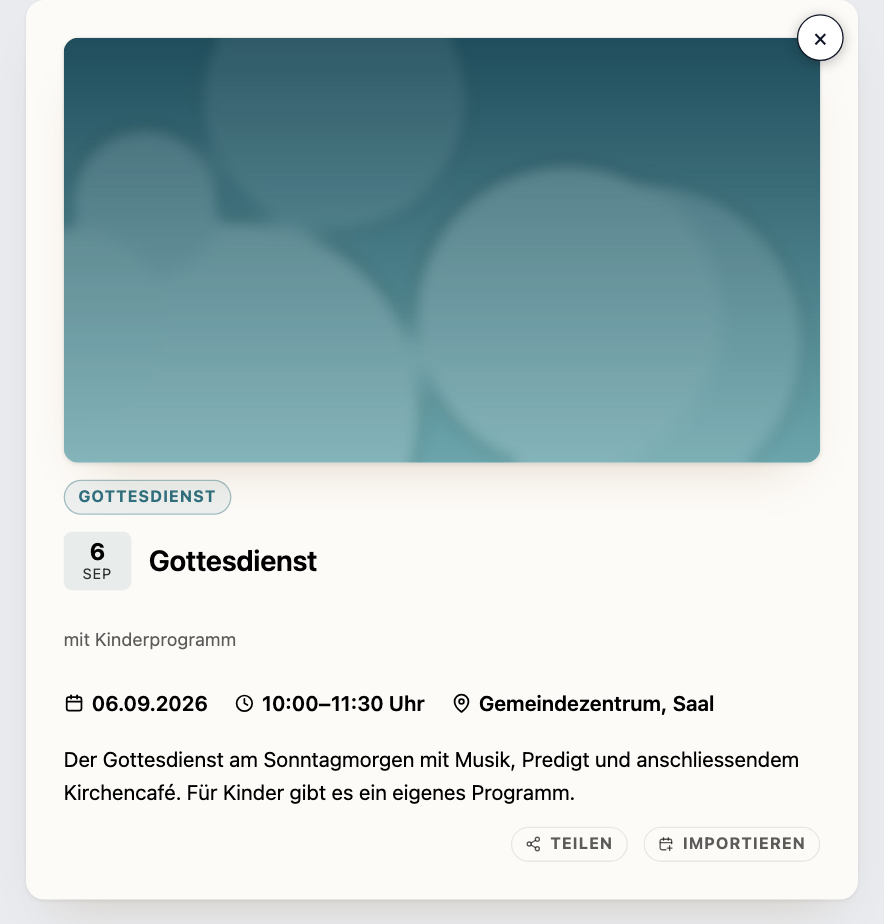
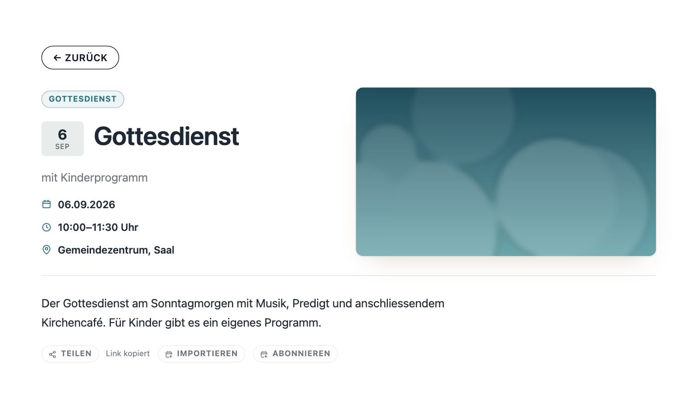

# Termine anzeigen

Zurück zur [Übersicht](../README.md).

## Drei Wege zum Einbinden

Alle drei benutzen denselben Unterbau und können dasselbe:

- **Gutenberg-Block:** Block „ChurchTools Events“ einfügen, alles Weitere in der Seitenleiste rechts.
- **WPBakery:** Element „ChurchTools Events“ aus der Kategorie „ChurchTools“ – oben die Kalender zum Anhaken, darunter der Rest, aufgebaut wie das Element „ChurchTools Gruppen“.
- **Shortcode** `[ctp_events]`: für Theme-Dateien, Widgets und alles andere.

## Die Ansichten

| Ansicht | `layout` | Beschreibung |
| --- | --- | --- |
| **Liste** | `list` | Kompakte Zeilen mit Datums-Chip, Titel, Zeit und Ort, die Kategorie rechts daneben; mit `month_dividers="1"` nach Monaten gruppiert. |
| **Raster** | `grid` | Bild, Datums-Badge und ein kurzer Auszug, Spaltenzahl einstellbar. Termine ohne eigenes Bild bekommen eine Fläche in der Farbe ihres Kalenders. |
| **Nächster Termin** | `upcoming` | Eine große Kachel für den nächsten Termin, darunter die folgenden in Kurzform. |

Dazu kommt der **Eventfinder** (`finder="1"`): ein geführter Einstieg statt Dropdown, mit einem Button je Thema in der Farbe des Kalenders und Knöpfen für den Zeitraum; mit `search="1"` steht das Suchfeld darin. Geht ein Zeitraum leer aus („Diesen Monat“ am Monatsende), stehen die nächsten Termine danach darunter statt einer leeren Liste.

Bilder der Ansichten zeigt die [Übersicht](../README.md#so-sieht-das-aus).

## Termine, die gerade stattfinden

Läuft ein Termin gerade, steht neben seinem Namen ein Kennzeichen mit einem pulsierenden Punkt – in allen drei Ansichten und in der Detailansicht. Es erscheint, sobald der Termin beginnt, und verschwindet, wenn er endet. Ganztägige Termine und mehrtägige Freizeiten tragen es an jedem ihrer Tage.

Das Wort steht unter *ChurchTools → Einstellungen → Design → Stil* bei **Laufende Termine** und ist ab Werk „Jetzt“. Dort passt jede Gemeinde es an ihren Ton an – „Live“, „Läuft gerade“, „Wir sind dabei“. **Ein leeres Feld schaltet das Kennzeichen ab.** Die Vorschau daneben zeigt beim Tippen, wie die Pille aussieht.

Die Entscheidung, ob ein Termin gerade läuft, fällt im Browser des Besuchers und nicht auf dem Server. Das ist Absicht: Ein Caching-Plugin legt die fertige Seite ab und liefert sie stundenlang unverändert aus – ein auf dem Server gesetztes „Jetzt“ bliebe darin stehen, lange nachdem der Termin vorbei ist. Die Uhr im Browser läuft dagegen immer richtig, auch aus dem Cache heraus. Wo JavaScript abgeschaltet ist, erscheint das Kennzeichen nicht; die Kachel sieht dann aus wie ohne die Funktion.

## Beispiele

**Startseite: der nächste Termin, groß, mit drei weiteren darunter**

```
[ctp_events layout="upcoming" limit="4"]
```

**Terminseite: alle Kalender mit geführter Suche und Monatsüberschriften**

```
[ctp_events layout="list" finder="1" search="1" month_dividers="1"]
```

**Nur die Gottesdienste als Raster, drei Spalten**

```
[ctp_events calendar="Gottesdienste" layout="grid" columns="3"]
```

**Teaser in der Seitenleiste: drei Termine, ohne Nachladen-Button**

```
[ctp_events layout="list" limit="3" paging="0"]
```

**Zwei Kalender, Auswahl per Dropdown und Suchfeld**

```
[ctp_events calendar="Gottesdienste,Jugend" layout="list" filter="1" search="1"]
```

Welche Kalender-Namen und -IDs zur Verfügung stehen, zeigt *Events → Kalender*. Unter *Events → Einbinden* stehen dieselben Beispiele noch einmal – dort mit einem echten Kalender aus der eigenen Instanz, fertig zum Kopieren, samt Tabelle aller Optionen.

## Die wichtigsten Optionen

| Option | Wirkung |
| --- | --- |
| `calendar` | Kalender-IDs und/oder -Namen, kommagetrennt. Leer = alle aktiven |
| `layout` | `list` (Standard), `grid` oder `upcoming` |
| `columns` | Spalten bei `grid`, 2–6 (Standard 3) – höchstens so viele, wie in den Inhaltsbereich passen, je Kachel mindestens 240px |
| `limit` | Obergrenze; bei `upcoming` die Gesamtzahl inklusive der großen Kachel |
| `finder` | Eventfinder: geführte Leiste mit Themen- und Zeitraum-Knöpfen (früher `eventfinder`, gilt weiter) |
| `filter` | Kalender-Dropdown, die einfache Variante des Eventfinders |
| `search` | Suchfeld – allein oder im Eventfinder |
| `month_dividers` | Termine nach Monaten gruppieren |
| `months` / `paging` | Länge eines Zeitraums bzw. der „Weitere Termine laden“-Button |
| `click` | Was ein Klick auf eine Kachel tut: `popup`, `page` oder `none` |

Die vollständige Referenz mit allen Standardwerten steht in der [readme.txt](../readme.txt), im Backend unter *Plugins → ChurchTools Events → Details* im Reiter *Verwendung*.

## Laden, Filtern, Suchen

**Es wird nicht alles auf einmal geladen.** Liste und Grid zeigen zunächst den laufenden und den nächsten Monat; „Weitere Termine laden“ hängt die folgenden an, ohne die Seite neu zu laden. Das hält die Seite schnell, auch bei vielen wöchentlichen Serien. Abschaltbar mit `paging="0"`.

**Filter und Suche laufen im Browser** und funktionieren deshalb auch hinter einem Caching-Plugin. Was jenseits des geladenen Zeitraums liegt, holt das Plugin bei Bedarf nach.

## Termindetails

Ein Klick auf einen Termin öffnet seine Details – als **Popup** auf derselben Seite oder als **eigene Terminseite**. Umgestellt wird das unter *Einstellungen → Design → Detailansicht* oder je Einbindung mit `click`.

### Teilen

Der „Teilen“-Button steht unter dem Termin, im Popup rechts unter der Beschreibung. Auf dem Telefon öffnet er das Teilen-Menü des Geräts, am Rechner legt er die Adresse des Termins in die Zwischenablage und meldet „Link kopiert“.

Im Bild zusammen mit dem Importieren-Button:



Auf der eigenen Terminseite steht er unter der vollen Breite, linksbündig an der Textkante – hier mit der Rückmeldung nach einem Klick am Rechner, daneben Importieren und Abonnieren:



### Importieren

Der „Importieren“-Button legt den Termin als Kalenderdatei ab, die Handy, Outlook und Thunderbird direkt öffnen – mit Titel, Zeit, Ort, Beschreibung, Kategorie und Bild, dazu Anschrift und Koordinaten, wo ChurchTools sie kennt.

Gehört der Termin zu einer Serie, fragt der Button nach dem Klick, was in die Datei soll: „Nur dieser Termin“ oder „Alle N Termine“. Die Zahl steht dort, weil „ganze Serie“ mehr verspräche, als sich halten lässt: Gezählt wird über den Basistermin aus ChurchTools, und ein dort einzeln nachbearbeitetes Datum zählt als eigener. Bei einem Einzeltermin entfällt die Rückfrage.

Die Datei ist eine Momentaufnahme: Ändert sich der Termin später, erfährt der Kalender davon nichts. Wer sie erneut herunterlädt, aktualisiert seinen Eintrag aber, statt einen zweiten anzulegen.

### Abonnieren

„Abonnieren“ trägt alle künftigen Termine des Kalenders dauerhaft ein. Der Kalender des Besuchers holt sie sich selbst wieder ab, Verschiebungen und Absagen kommen von allein an.

### Knöpfe ein- und ausschalten

Alle drei Knöpfe sind standardmäßig aus. Eingeschaltet werden sie unter *Einstellungen → Design → Detailansicht* unter *Aufbau der Detailansicht*, wo sie sich wie jedes andere Feld frei platzieren lassen. Jeder ist einzeln schaltbar; zwei passen gut nebeneinander, bei dreien wird es im Popup eng.

Keiner der Knöpfe lädt ein Skript von Drittanbietern oder ein Zählpixel.

## Adressen der Terminseiten

Jeder Termin hat eine eigene Adresse aus **Titel und Datum** (`gottesdienst-06-09-2026`), nicht aus einer Nummer und nicht aus dem Titel allein: „Gottesdienst“ gibt es jedes Wochenende, ein Titel benennt also eine Serie und nicht einen Termin. Ändert sich der Titel in ChurchTools, ändert sich die Adresse mit. Wird die Elternseite nachträglich gesetzt, leiten die bisherigen Adressen dauerhaft auf die neuen weiter. Wie man die Elternseite setzt: [Einrichtung, Schritt 6](EINRICHTUNG.md#6-eigene-terminseiten-optional).

## Suchmaschinen und Bilder

- **Strukturierte Daten:** Jeder Termin trägt schema.org/Event-Daten, hat einen Eintrag in einer eigenen Sitemap und passende Angaben für die Vorschau beim Teilen – verträglich mit Yoast SEO und Rank Math.
- **Vollständiger Ort:** Der Ort steht als Anschrift mit Koordinaten, wo ChurchTools eine kennt – bei einem gebuchten Raum die Anschrift der Gemeinde, bei einem auswärtigen Termin dessen eigene.
- **Passende Bildgrößen:** eigene Bildbreiten plus `srcset`, WebP beim Import, ein Bild je Terminserie statt je Termin.
- **Keine Abrufe bei ChurchTools:** Bilder werden importiert statt nachgeladen; Besucher laden nichts von der ChurchTools-Domain.

## Eigenes Layout

Möglich, aber selten nötig: Die Templates aus `includes/Frontend/templates/` lassen sich nach `wp-content/themes/euer-theme/churchtools-plugin/` kopieren und dort anpassen – updatesicher. Details in der [readme.txt](../readme.txt); welche Vorlagen stabil bleiben, steht in der [Kompatibilitätszusage](COMPATIBILITY.md).
